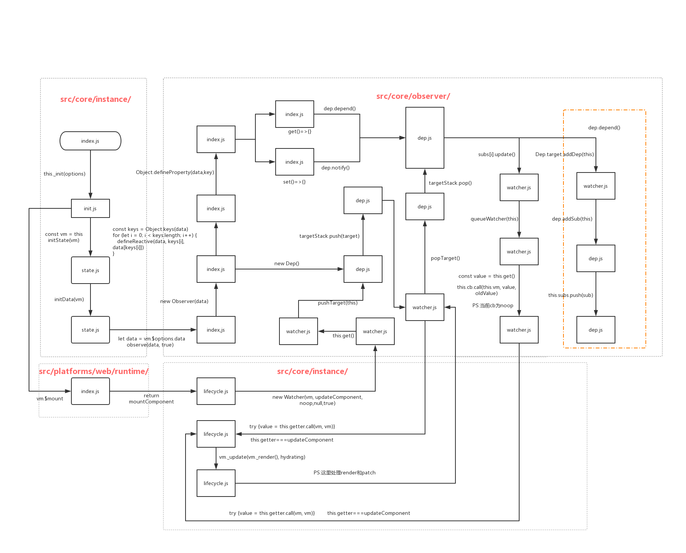

# Vue里面的响应式实现

​		如果直接看Vue源码是如何实现响应式，是比较不容易理解的，主要是源码真的是有点绕，多个文件调来调去，所以我这边整理了一下流程：

## 基本流程

涉及到的文件：

+ [/src/core/instance/index.js]( https://github.com/vuejs/vue/blob/dev/src/core/instance/index.js)
+ [/src/core/instance/init.js]( https://github.com/vuejs/vue/blob/dev/src/core/instance/init.js)
+ [/src/core/instance/state.js]( https://github.com/vuejs/vue/blob/dev/src/core/instance/state.js)
+ [/src/core/observer/index.js]( https://github.com/vuejs/vue/blob/dev/src/core/observer/index.js)
+ [/src/core/observer/watcher.js]( https://github.com/vuejs/vue/blob/dev/src/core/observer/watcher.js)
+ [/src/core/observer/dep.js]( https://github.com/vuejs/vue/blob/dev/src/core/observer/dep.js)
+ [/src/core/lifecycle.js]( https://github.com/vuejs/vue/blob/dev/src/core/lifecycle.js)
+ [/src/platforms/web/runtime/index.js](https://github.com/vuejs/vue/blob/dev/src/platforms/web/runtime/index.js) （PS：这个文件和Vue版本有关，默认webpack打包并且是Web环境，会执行这个文件）




这张图里面基本包含了Vue响应式的所有主要函数，其实从图上看来，还是比较复杂的，接下来我会分区域逐步讲解这个图片上都做了什么。

## 详细讲解

### src/core/instance

这个部分是Vue开始初始化的时候就需要执行的代码

```js
//index.js
this._init(options)
```

这段代码传参开始进入Vue的初始化阶段

> Vue的初始化是执行init函数，但是执行完init函数并没有完成响应式化，因为Vue是在$mount的时候（即挂载）时，才会执行watcher的初始化。所以真正的响应式必须要是一个被挂载的组件上才能体现。

```js
//init.js
Vue.prototype._init = function (options?: Object) {
    const vm: Component = this
 		...
}
```

   这是真正开始执行init函数定义的地方，注意这里的vm的数据类型是Component

>  vm是Vue的实例化，但其实vm的数据类型是Component，`const vm: Component = this`，也就是说本质上，Vue实例化的过程，就是创建组件的过程，但是正如第一点说的，只是初始化了组件并不完整，最终组件是需要挂载$mount来完成响应式。

```js
//state.js
initData(vm)
```

开始执行初始化data，`state.js`内其实需要处理所有能够被`this.`找到的东西，包括props，methods，data，computed，watch。

> 1. Vue在初始化的时候，data能够接受一个函数返回值的原因就是因为在initData的时候，如果`typeof vm.$options.data===‘’function“`的值为true的时候，会执行一次这个data函数获取返回值
> 2. 初始化顺序是 props->methods->data->computed->watch，所以在data函数中，可以访问props参数，在computed可以访问data数据，watch监听所有，是因为数据初始化顺序

```js
//state.js
let data = vm.$options.data
...
proxy(vm, `_data`, key)
...
observe(data, true /* asRootData */)
```

拿到data参数之后，通过observe方法开始给data内的数据添加响应式处理。

> 1. props也需要响应式化，但是流程比较data相对简单点，核心方法一样
> 2. 这里的proxy不是对数据响应式的那个Proxy，而是处理this指针指向的问题，通过`Object.defineProperty(vm, key, sharedPropertyDefinition)`方法，把对vm.xxx的访问代理成了vm._data.xxx的访问。从而实现了Vue内部可以使用this.xxx来访问数据。

```js
//init.js
if (vm.$options.el) {
  vm.$mount(vm.$options.el)
}
```

在初始化执行完毕之后（所有的init执行完），如果当前的参数里面有el的话，就会执行挂载

> Vue的watcher实例化是在这个阶段，响应式需要真正跑起来，还记得watcher内的函数是需要被执行一次收集依赖的么？Vue就是在这个时候收集依赖的。不过过程稍微复杂一点


### src/platforms/web/runtime/

```js
//index.js
Vue.prototype.$mount = function(){
  ...
	return mountComponent(this, el, hydrating)
}
```

这里提供了一个通用的挂载方法，实际上是执行了`mountComponent`函数

> 这里需要注意的是，Vue根据引用版本不同，当前的runtime内执行的文件是不一样的，默认的浏览器版本Vue才是这个文件，Weex和本地编译，都不是这个文件。


### src/core/instance/

```js
//lifecycle.js
  new Watcher(vm, updateComponent, noop, {
    before () {
      if (vm._isMounted && !vm._isDestroyed) {
        callHook(vm, 'beforeUpdate')
      }
    }
  }, true /* isRenderWatcher */)
```

这里才是真正初始化了Watcher，执行了内部的计算函数。这几个参数稍微讲解下

+ vm：当前的Vue实例（也就是当前组件）
+ updateComponent：计算函数，用来计算组件内各个数据的值，每次Vue的数据变化，其实就是需要重新触发这个函数的计算，从而实现响应式的数据更新。这个函数内部有点复杂，之后聊到组件实现细节再提好了。
+ noop：回调函数，计算完数据更新之后的回调函数。我们在Vue中写的Watch内的回调，就是在这里被执行了
+ before：钩子函数，数据更新之前会执行
+ true：是不是一个renderWatcher，如果是一个渲染watcher，会有个单独的指针提供访问，其余的watchers里面，其实是不涉及到重新render的，执行时机就不一样了。

```js
//lifecycle.js
updateComponent = () => {
      vm._update(vm._render(), hydrating)
}
```

这里就是执行数据的重新计算函数，本质上会接受两个参数

+ vm._render()：返回值是一个Vnode，用来重新渲染页面
+ hydrating：状态位，用来判断是不是第一次渲染（计算量不同）

```js
//lifecycle.js
vm.$el = vm.__patch__(prevVnode, vnode)
```

在这个地方，处理真正的渲染成HTML节点并且挂在对应的真实dom上面。

执行完所有的这一切，第一次生命周期就结束了。这里会返回一个VM，然后我们重新回到响应式内部看看代码，因为Watcher虽然初始化完了，但是我们的`updateComponent`只执行完了第一次计算，之后的计算就要回到响应式来触发了。